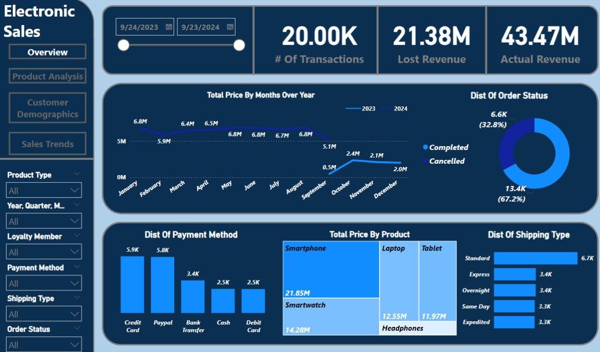

# 🚀 Interactive Electronic Sales Dashboard 📊

Welcome to the **Interactive Electronic Sales Dashboard** project! This repository contains an interactive dashboard designed to analyze electronic sales data from **September 2023 to September 2024**. The dashboard provides valuable insights into financial performance, customer behavior, and product trends, enabling businesses to make data-driven decisions and optimize marketing and sales efforts.

## 📊 Dashboard Overview

Here’s a snapshot of the **Interactive Electronic Sales Dashboard** created using Power BI:

## 🌟 Objective

This project aims to:
- **Enhance understanding** of customer purchasing patterns and product trends.
- **Provide actionable insights** to optimize marketing strategies and improve sales performance.

## 📊 Scope of Analysis

Our analysis focuses on the following key areas:
- **Product Analysis**: Identifying top-performing product categories, ranking products by revenue, and analyzing customer ratings and quantities sold.
- **Customer Analysis**: Exploring customer demographics, loyalty program behavior, and the relationship between add-on purchases and loyalty.
- **Sales Trends**: Analyzing sales trends over time, identifying periods of growth or decline, and comparing performance across months and weekdays.
- **Financial Performance**: Tracking key financial metrics such as total revenue, transaction count, and potential losses.

## 🛠️ Technologies and Tools

- **Power BI**: All analysis and visualization were conducted using Power BI, leveraging its powerful capabilities for creating interactive dashboards.
- **Data Cleaning & Analysis**: Ensuring accuracy and consistency of the data to deliver meaningful insights.

## 🔍 Insights Uncovered

Some of the key insights discovered in the analysis include:
- **Customer Behavior**: Certain product categories show higher sales volumes during specific months, with some customers consistently returning for add-on purchases.
- **Sales Performance**: Sales performance peaks during specific months and weekdays, with potential for targeted promotions.
- **Financial Metrics**: Revenue patterns indicate areas where sales strategies can be optimized to reduce potential losses.

## 🚀 Key Insights and Recommendations

- **Customer Satisfaction and Retention Insight**: Add-on purchases are strongly tied to customer loyalty.  
  **Recommendation**: Introduce loyalty rewards or targeted discounts to encourage repeat purchases and increase customer retention.

- **Product Focus Insight**: Some product categories outperform others in revenue generation.  
  **Recommendation**: Focus marketing efforts on top-performing categories and identify opportunities to optimize lower-performing products.

- **Seasonal Sales Insight**: Certain months show a spike in sales.  
  **Recommendation**: Plan for seasonal campaigns during peak sales months to maximize revenue potential.

- **Sales Growth Opportunity Insight**: Weekdays show varying sales trends.  
  **Recommendation**: Implement weekday-specific promotions to boost sales during lower-traffic periods.

## 📬 Contact

For inquiries, feedback, or collaboration opportunities, feel free to reach out:

**Mostafa Gasser**  
Email: [mostgasser1@gmail.com](mailto:mostgasser1@gmail.com)  
Location: Cairo, Egypt  
Open to freelance opportunities and collaborations!
